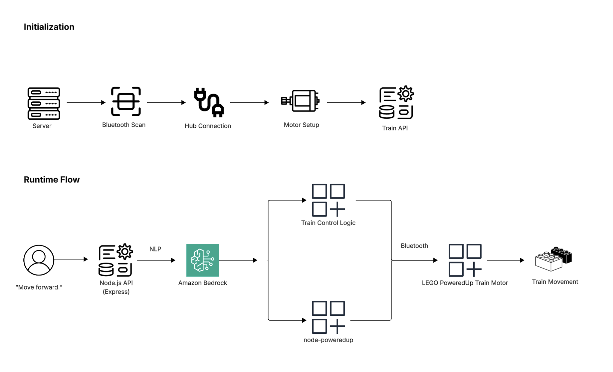

# AI-Powered LEGO Train Control System


## 🧠 How It Works

The system will allow users to control a LEGO train using NLP.

When a user enters a command such as "move forward" in the app, the request is sent to a backend API. The backend then forwards the input to Amazon Bedrock, where the NLP is interpreted and transformed into a structured command. (e.g. MOVE FORWARD) Once the structured command is returned, the backend maps it to a device specific instruction and sends it to LEGO train controller. The command is connected via Bluetooth, allowing the train to execute the action in real time.

### Example Transformation

Input:  
"Move Forward"

Output:

```
{
  "action": "forward",
  "speed": 30,
  "durationMs": 1000
}
```

> Note: speed and duration are predefined as default parameters and are not controlled by user input.

## 🏗 Architecture

<p>
  
<br />
  <sub>Architecture diagram created with Lucidchart</sub>
</p>

## 🚀 Features

- Control a physical LEGO train using natural language commands. (e.g. "move forward", "move backward", "stop")
- Powered by Amazon Bedrock to interpret user input and generate structured control instructions.
- Real-time interaction between user input and hardware execution.
- Converts unstructured human language into actionable device commands.
- Demonstrates end-to-end AI-driven system from input to physical output.

## 🛠 Tech Stack

#### ▫️ Frontend

- React
- Tailwind CSS

#### ▫️ Backend

- Node.js / Express.js

#### ▫️ AI
- Amazon Bedrock (NLP)

#### ▫️ IoT Control

- [node-poweredup](https://github.com/nathankellenicki/node-poweredup) (LEGO device control)
- Bluetooth

## ⌘ Supported Commands

- "Move forward"
- "Move backward"
- "Stop"

## 📦 Installation

This project requires specific hardware and environment setup to run.

You will need:

- Powered Up Hub (#88009) to connect for Bluetooth connectivity.
- A backend service configured to communicate with Amazon Bedrock.
- Proper environment variables and API access.

> Note: This project was tested using a LEGO train equipped with a Powered Up Hub.
